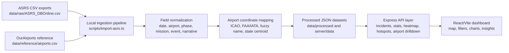

# ASRS Aviation Safety Intelligence

[](https://react.dev/)
[](https://vitejs.dev/)
[](https://www.typescriptlang.org/)
[](https://asrs.arc.nasa.gov/)
[](#data-sources)

**Historical Aviation Safety Intelligence Dashboard for General Aviation and Non-Towered Airport Risk Analysis.**

This repository provides a research-oriented aviation safety analytics platform for exploring historical NASA ASRS safety reports. It ingests local ASRS CSV exports, normalizes reported incident fields, maps airport/location references to coordinates using the OurAirports reference dataset, and visualizes reported operational risk patterns in a React/Vite intelligence dashboard.

The system is designed for historical incident analysis, safety intelligence, and operational risk visualization. It is not an operational surveillance system and does not forecast accidents.

## Screenshots

> Screenshot placeholders for project documentation and research portfolio use.


## Features

- Interactive U.S. incident map for historical ASRS reports
- Heatmap visualization by airport, state, and coordinate cluster
- Airport hotspot analysis with known-airport ranking
- Flight phase filtering and trend exploration
- Severity analysis using rule-based historical risk scoring
- CTAF and non-towered operational analysis
- Narrative keyword extraction from ASRS report text
- Historical incident trend summaries
- Airport clustering and nearby incident grouping
- Research-oriented analytics, KPIs, charts, filters, and export workflows

## Architecture



The project uses a local-first research workflow:

```text
ASRS CSV exports
  -> local ingestion pipeline
  -> normalized incident schema
  -> airport coordinate mapping
  -> processed JSON
  -> API layer
  -> React visualization dashboard
```

## Data Sources

### NASA ASRS

The primary source is the NASA Aviation Safety Reporting System (ASRS), a voluntary confidential safety reporting system. This project analyzes historical ASRS report exports to identify reported safety concern patterns, operational contexts, and recurring themes in General Aviation and non-towered airport environments.

Important ASRS interpretation notes:

- ASRS reports are historical and self-reported.
- The dataset does not represent official accident or incident statistics.
- Report counts reflect reporting patterns as well as operational safety concerns.
- The dashboard visualizes reported safety concern patterns, not live aircraft activity.

### OurAirports

Airport coordinates and airport metadata are mapped using the OurAirports reference dataset, expected at:

```text
data/reference/airports.csv
```

Coordinate matching priority:

1. ICAO/GPS airport code
2. FAA/local/IATA-style airport code
3. Airport name fuzzy matching
4. State centroid fallback

Each processed incident includes `coordinateConfidence`:

- `high`: code-based airport match
- `medium`: fuzzy airport-name match
- `low`: fallback coordinate, usually state centroid or unresolved location

## Installation

```bash
npm install
npm run import:asrs
npm run dev
```

Open the local Vite dashboard at:

```text
http://127.0.0.1:5173
```

The local API runs at:

```text
http://127.0.0.1:8787
```

## Real Data Workflow

1. Download an ASRS CSV export from NASA ASRS.
2. Place the ASRS export in:

   ```text
   data/raw/ASRS_DBOnline.csv
   ```

3. Place the OurAirports reference file in:

   ```text
   data/reference/airports.csv
   ```

4. Run the importer:

   ```bash
   npm run import:asrs
   ```

5. Launch the dashboard:

   ```bash
   npm run dev
   ```

The importer writes normalized datasets to:

```text
data/processed/asrs_incidents.json
server/data/asrs_incidents.json
public/data/asrs_incidents.json
```

Synthetic sample generation remains available only as a fallback/demo utility:

```bash
npm run generate:data
```

## API

The Express API serves historical ASRS-derived data and dashboard summaries.

- `GET /api/asrs/incidents`
- `GET /api/asrs/incidents/:id`
- `GET /api/asrs/stats`
- `GET /api/asrs/filters`
- `GET /api/asrs/insights`
- `GET /api/asrs/heatmap`
- `GET /api/asrs/hotspots`
- `GET /api/asrs/airport/:code`
- `GET /api/asrs/export`

Supported filters include:

```text
year, startYear, endYear, incidentType, severity, aircraftType,
flightPhase, state, airportType, altitudeMin, altitudeMax, keyword,
weather, visibility, operationType, eventCategory, contributingFactor,
airportCode
```

## Project Structure

```text
data/raw/                  Local ASRS CSV exports
data/reference/            Airport reference datasets
data/processed/            Normalized historical ASRS JSON output
server/                    Express API layer
server/data/               API-ready processed datasets
scripts/import-asrs.ts     Real ASRS ingestion and normalization pipeline
scripts/generate-data.ts   Synthetic fallback dataset generator
src/components/            Map, charts, KPIs, filters, table, detail panel
src/data/                  Shared schema and synthetic fallback generator
src/services/              Analytics, filtering, exports, API loading
src/styles/                Dashboard styling
```

## Research Context

This repository supports aviation safety analytics work focused on historical reported incident analysis. It is suitable for research prototypes, portfolio evidence, reviewer demonstrations, and reproducible local data workflows.

Current research alignment:

- Paper 1: ASRS-based safety analysis
- Non-towered airport operational risk analysis
- General Aviation situational awareness studies
- CTAF and traffic-pattern conflict exploration
- Future ADS-B integration research
- Surveillance gap analysis and data fusion design

The dashboard is intended to help researchers examine historical safety narratives, recurring operational risk patterns, geographic clusters, and keyword-driven themes across reported ASRS events.

## Deployment

The frontend can be deployed to Vercel as a static React/Vite application.

Recommended deployment model:

- Connect the GitHub repository to Vercel.
- Configure automatic redeploy on push.
- Run the ingestion pipeline locally or in a trusted build workflow before deployment.
- Commit the processed static dataset at `public/data/asrs_incidents.json`.
- Use frontend-only deployment for public portfolio views; the deployed static site reads `/data/asrs_incidents.json` directly.
- Keep the Express API for local development and richer local workflows.

Deployment workflow:

```bash
npm run import:asrs
git add public/data/asrs_incidents.json data/processed/asrs_incidents.json server/data/asrs_incidents.json
git commit -m "update ASRS processed dataset"
git push
```

Vercel automatically redeploys after the GitHub push. For static deployments, ensure the processed historical JSON dataset is available at `public/data/asrs_incidents.json`. Do not represent the deployed dashboard as operational monitoring or aircraft tracking.

## Disclaimer

NASA ASRS reports are voluntary, confidential, and self-reported. They are valuable for identifying reported safety concerns, operational narratives, and human factors themes, but they do not represent official accident statistics, traffic exposure, causal proof, or comprehensive event rates.

This dashboard is intended for research and visualization purposes only. It should not be used for operational decision-making, regulatory enforcement, safety forecasting, or aircraft surveillance.

## Future Work

- ADS-B integration for post-hoc trajectory enrichment
- Historical trajectory analysis and replay workflows
- Real-time conflict detection as a separate future research track
- NLP-based risk classification and topic modeling
- Aviation data fusion framework across ASRS, ADS-B, weather, and airport metadata
- Surveillance gap analysis for non-towered and uncontrolled airport environments
- Improved entity extraction for airports, aircraft types, procedures, and contributing factors
- Research validation notebooks and reproducible analysis exports

## Development Notes

Run type checking:

```bash
npm run lint
```

Build the production frontend:

```bash
npm run build
```

The project intentionally uses historical analysis terminology such as safety intelligence, operational risk visualization, reported incident analysis, and aviation safety analytics. Keep repository language anchored in historical reported-incident analysis rather than operational monitoring claims.
